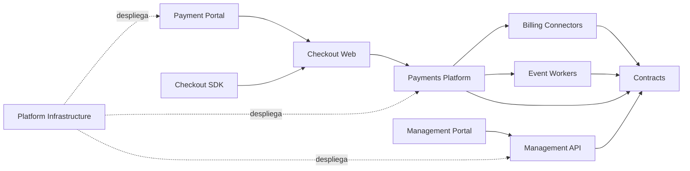

# NexoPay

Repositorio general de arquitectura e incubacion de NexoPay. Este repositorio
define la vision del sistema, los limites entre componentes, las decisiones
tecnicas y la bitacora de desarrollo. El codigo de cada componente se versiona
en un repositorio independiente.

## Objetivo

NexoPay sera una plataforma multiempresa y multicanal para pagar cuentas y
compras desde dos productos:

- **Portal de pagos:** experiencia publica alojada por NexoPay.
- **NexoPay Checkout:** checkout alojado que los comercios integran mediante
  link, redireccion o un SDK que abre un iframe seguro.

Ambos productos utilizan el mismo nucleo transaccional. Los canales no deciden
el resultado financiero ni almacenan credenciales privadas.

## Arquitectura

El flujo transaccional y el plano de gestion estan separados. Reportes,
exportaciones y configuraciones no pueden degradar una autorizacion de pago.

## Repositorios

| Repositorio | Responsabilidad |
| --- | --- |
| [nexopay-payment-portal](https://github.com/7yrak/nexopay-payment-portal) | Portal publico para consultar deudas e iniciar pagos. |
| [nexopay-management-portal](https://github.com/7yrak/nexopay-management-portal) | Administracion para comercios y operadores. |
| [nexopay-checkout-web](https://github.com/7yrak/nexopay-checkout-web) | Interfaz segura alojada dentro del iframe. |
| [nexopay-checkout-sdk](https://github.com/7yrak/nexopay-checkout-sdk) | SDK web sin dependencia de framework. |
| [nexopay-payments-platform](https://github.com/7yrak/nexopay-payments-platform) | Checkout API, Payment Core, ledger y conectores PSP. |
| [nexopay-management-api](https://github.com/7yrak/nexopay-management-api) | Comercios, usuarios, configuracion y consultas operativas. |
| [nexopay-billing-connectors](https://github.com/7yrak/nexopay-billing-connectors) | Adaptadores de empresas de servicios y facturadores. |
| [nexopay-event-workers](https://github.com/7yrak/nexopay-event-workers) | Webhooks, notificaciones, conciliacion y trabajos asincronos. |
| [nexopay-platform-infrastructure](https://github.com/7yrak/nexopay-platform-infrastructure) | Terraform, Kubernetes, Jenkins y observabilidad. |
| [nexopay-contracts](https://github.com/7yrak/nexopay-contracts) | OpenAPI, AsyncAPI, eventos y reglas de compatibilidad. |

Los clones locales viven en `components/` y no son submodulos ni contenido de
este repositorio.

## Principios obligatorios

- Toda operacion mutante de pagos debe ser idempotente.
- PostgreSQL es la fuente de verdad; Redis nunca almacena verdad financiera.
- Los montos se representan como enteros en unidad minima y con moneda.
- El ledger es inmutable y de partida doble.
- Los eventos se procesan al menos una vez; cada consumidor deduplica.
- Ningun frontend recibe secretos de comercio o proveedor.
- Los datos de tarjeta solo se capturan en superficies alojadas y controladas.
- Cada repositorio consume contratos publicados, nunca codigo interno de otro.
- Toda llamada y evento propaga `correlation_id`, `tenant_id` e identificadores
  de negocio cuando corresponda.
- Las migraciones deben ser compatibles hacia atras durante los despliegues.

## Tecnologias base

- Frontend: TypeScript, React y Next.js.
- Checkout SDK: TypeScript, Web Components y Vite.
- Backend: Kotlin, Java 21, Spring Boot y Gradle.
- Datos: PostgreSQL, Kafka, Redis y almacenamiento de objetos.
- Contratos: OpenAPI, AsyncAPI y JSON Schema.
- Plataforma: Docker, Kubernetes, Helm, Terraform y Jenkins.
- Observabilidad: OpenTelemetry, Prometheus, Grafana y logs estructurados.

Las versiones exactas se fijaran en cada repositorio y se actualizaran mediante
pull requests. No se usara `latest` en imagenes desplegables.

## Flujo de trabajo

1. Registrar una decision relevante en `docs/adr/`.
2. Actualizar primero el contrato si cambia una API o un evento.
3. Implementar en una rama corta y abrir pull request.
4. Ejecutar lint, pruebas, analisis de seguridad y build reproducible.
5. Publicar artefactos inmutables identificados por commit SHA.
6. Desplegar primero en desarrollo, luego staging y finalmente produccion.
7. Anotar hitos y cambios de direccion en la bitacora.

## Documentacion

- [Arquitectura](docs/ARCHITECTURE.md)
- [Plan de desarrollo](docs/DEVELOPMENT_PLAN.md)
- [Cierre de la etapa 0](docs/discovery/PHASE_0_DISCOVERY.md)
- [Gates obligatorios antes de produccion](docs/discovery/PRODUCTION_GATES.md)
- [Threat model inicial](docs/discovery/THREAT_MODEL.md)
- [Fundacion completada de la etapa 1](docs/implementation/PHASE_1_FOUNDATION.md)
- [Estandar de observabilidad](docs/engineering/OBSERVABILITY_STANDARD.md)
- [Catalogo y dependencias](docs/REPOSITORIES.md)
- [Bitacora de desarrollo](docs/DEVELOPMENT_LOG.md)
- [Decisiones de arquitectura](docs/adr/README.md)

## Estado actual

Las etapas 0 y 1 estan `DONE` para el alcance de Alpha interna sintetica. Existen
contratos v1 versionados, deteccion de breaking changes, infraestructura local
verificada, Jenkins real y estandar de observabilidad. La siguiente etapa es el
nucleo transaccional.

Esto no habilita produccion: legal, PCI, privacidad, PSP, convenio ESVAL, cloud,
capacidad, recuperacion y pentest permanecen como gates abiertos. Hasta pasarlos
se prohiben datos, credenciales y dinero real.
