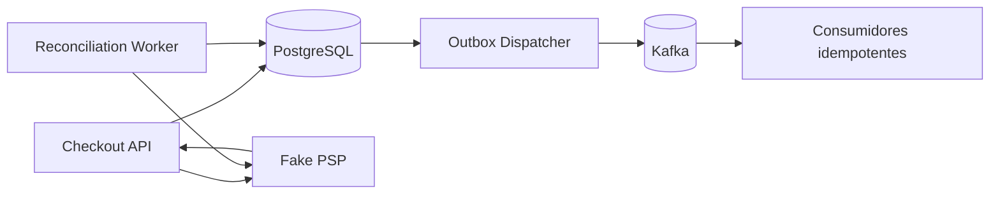

# Arquitectura de NexoPay

## Contexto

NexoPay integra empresas facturadoras, comercios, pagadores y proveedores de
pago. Debe soportar altos volumenes sin acoplar la experiencia del usuario con
procesos secundarios como reportes, notificaciones o conciliacion.

## Planos

### Plano transaccional

Incluye Payment Portal, Checkout Web, Checkout SDK y Payments Platform. Su
objetivo es crear, procesar y consultar pagos con baja latencia, idempotencia y
trazabilidad.

### Plano de gestion

Incluye Management Portal y Management API. Administra tenants, usuarios,
credenciales, branding, webhooks y consultas. No escribe directamente tablas
del nucleo de pagos.

### Plano asincrono

Event Workers consume eventos publicados mediante transactional outbox. Se
encarga de webhooks, notificaciones, conciliacion y proyecciones de lectura.

### Plano de integracion

Billing Connectors encapsula protocolos y modelos particulares de empresas de
servicios. Payments Platform encapsula por separado los conectores de PSP y
adquirentes, porque sus estados forman parte de la maquina de pagos.

## Nucleo transaccional implementado

La etapa 2 materializa Payments Platform como un monolito modular Kotlin/Spring.
La separacion interna mantiene API, pago, checkout, proveedor, ledger, outbox e
idempotencia como limites explicitos sin introducir coordinacion distribuida.

PostgreSQL es la fuente de verdad de payment intents, sesiones, intentos de
proveedor, idempotencia, ledger y outbox. El dispatcher publica a Kafka al menos
una vez; los consumidores deduplican por `eventId`. Redis no participa en las
decisiones canonicas.

La confirmacion registra primero `PROCESSING` y el intento de proveedor, invoca
el adaptador fuera de la transaccion y luego persiste el resultado. Un resultado
ambiguo queda `UNKNOWN` y se reconcilia; nunca se traduce automaticamente en
rechazo. En una captura, pago, dos asientos balanceados y evento outbox quedan
en una sola transaccion PostgreSQL.

## Flujo de checkout embebido

1. El backend del comercio crea una sesion mediante Checkout API.
2. La API valida comercio, monto, expiracion y referencia externa.
3. El navegador recibe solo un identificador temporal de sesion.
4. Checkout SDK abre Checkout Web dentro de un iframe NexoPay.
5. Checkout Web confirma el pago contra Payments Platform.
6. El resultado visual se comunica por `postMessage` con origen validado.
7. El resultado definitivo se entrega al comercio mediante webhook firmado.

## Consistencia

- Comandos HTTP: idempotencia persistida y restricciones unicas.
- Publicacion de eventos: transactional outbox.
- Consumo de eventos: at-least-once con inbox o deduplicacion equivalente.
- Integraciones externas: estados intermedios y reconciliacion; un timeout no
  equivale a rechazo.
- Ledger: movimientos append-only y correcciones compensatorias.
- Contabilidad: el ledger registra cuentas operacionales por cobrar y por pagar;
  no representa fondos custodiados por NexoPay.

## Escalabilidad

Los servicios son stateless salvo sus almacenes externos. El particionamiento
se introduce por medicion, no por anticipacion. Las primeras claves candidatas
son fecha de creacion y `tenant_id`. Kafka se particiona por agregado para
preservar orden local, por ejemplo `payment_id`.

## Seguridad

- OAuth 2.0/OIDC para identidades y clientes de servidor.
- Sesiones cortas y cookies seguras para portales.
- WAF, rate limiting y proteccion contra abuso por tenant.
- Secretos en un secret manager y rotacion auditable.
- Cifrado en transito y reposo.
- RBAC con minimo privilegio y separacion de funciones.
- Auditoria inmutable para operaciones administrativas sensibles.
- CSP estricta y validacion de origen en superficies embebidas.
- Tokenizacion para evitar persistir PAN siempre que el proveedor lo permita.

## Disponibilidad y operacion

Antes de produccion se definiran SLO por capacidad medida. Como punto de
partida, el camino de pagos debe tener despliegue multi-zona, readiness probes,
autoscaling, circuit breakers, backups restaurables y runbooks. La recuperacion
se valida mediante ejercicios, no solo mediante existencia de backups.
