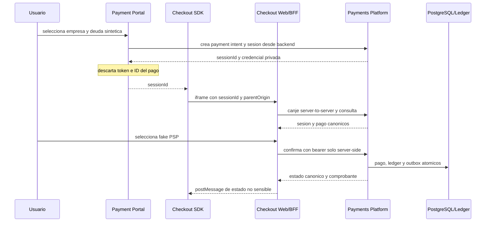

# Etapa 3 - Checkout vertical slice

## Estado

- Estado: `DONE`.
- Inicio y cierre: 2026-07-17.
- Ambiente: `dev` local, Docker Compose, loopback y datos sinteticos.
- Baseline contractual: tag inmutable `contracts-v1-alpha.3`.
- Navegadores soportados en Alpha: Google Chrome desktop y emulacion movil.

## Objetivo

Completar y automatizar el recorrido deuda sintetica -> payment intent ->
checkout session -> fake PSP -> ledger -> comprobante, sin exponer credenciales
de sesion o autoridad financiera al portal o al parent del iframe.

## Tablero de trabajo

| ID | Entregable | Repositorio | Estado |
| --- | --- | --- | --- |
| E3.1 | Contratos runtime de checkout, comprobante y browser message | nexopay-contracts | DONE |
| E3.2 | BFF, cancelacion, consulta y expiracion en Payments Platform | nexopay-payments-platform | DONE |
| E3.3 | Web Component, iframe seguro y ejemplos de integracion | nexopay-checkout-sdk | DONE |
| E3.4 | Checkout Web accesible, recuperable y con CSP dinamica | nexopay-checkout-web | DONE |
| E3.5 | Portal empresa/deuda y creacion server-side de sesion | nexopay-payment-portal | DONE |
| E3.6 | Compose, Playwright y jobs Jenkins | nexopay-platform-infrastructure | DONE |

## Arquitectura implementada

Payment Portal y Checkout Web no importan codigo del nucleo. El primero actua
como BFF de iniciacion y el segundo como BFF de ejecucion. El SDK solo conoce el
ID opaco de sesion y el origen publico de Checkout Web.

## Seguridad verificada

- La Route Handler del portal retorna solo `{sessionId}` y rechaza bill IDs que
  no pertenecen al catalogo server-side.
- `CHECKOUT_CLIENT_SECRET` existe solo en Payments Platform y Checkout Web BFF.
- El bearer no aparece en HTML, atributos, storage, payloads de parent ni API
  browser; el contrato rechaza propiedades adicionales sensibles.
- Checkout Web acepta `parentOrigin` solo si coincide exactamente con la
  allowlist de la sesion y emite CSP `frame-ancestors` desde esa allowlist.
- El SDK valida origen, `event.source`, version, sesion y schema; usa target
  origin exacto, iframe sandbox y Shadow DOM cerrado.
- Sesiones expiradas no pueden reemitir token. Confirmacion, cancelacion y
  replays se serializan en el nucleo y no duplican ledger.
- El comprobante se deriva de una transaccion capturada en ledger.
- CSP, Referrer Policy, Permissions Policy y `nosniff` estan activos. Los tres
  contenedores frontend ejecutan como usuario no-root.

## Experiencia implementada

- Portal responsive con seleccion de empresa y deuda de agua sintetica. La
  referencia ESVAL se marca expresamente como objetivo sin convenio oficial.
- SDK en modal, inline y redirect, con cierre visual que permite reingreso.
- Checkout con estados ready, processing, failed, pending, cancelled y success.
- Refresh recupera pago y comprobante desde backend; back vuelve al portal con
  el mismo `sessionId` almacenado en `sessionStorage`.
- Fake PSP cubre exito, rechazo, timeout y exito tardio reconciliable.
- Ejemplos compilados para HTML, React 19, Angular 22 y Vue 3.

## Criterios de salida

- [x] Demo automatizada desde deuda sintetica hasta ledger y comprobante.
- [x] SDK funcional en HTML, React, Angular y Vue.
- [x] Ningun secreto o dato financiero sensible cruza al parent del iframe.
- [x] Playwright cubre exito, rechazo, timeout, cierre y reingreso.
- [x] Alpha interna desplegada en ambiente local `dev`.

## Evidencia

### Contratos y nucleo

- Contracts commits
  [`ba17a59`](https://github.com/7yrak/nexopay-contracts/commit/ba17a59) y
  [`f8cf639`](https://github.com/7yrak/nexopay-contracts/commit/f8cf639), tag
  `contracts-v1-alpha.3`: 22 schemas, 13 ejemplos y 15 pruebas.
- Payments Platform commits
  [`e5f0f10`](https://github.com/7yrak/nexopay-payments-platform/commit/e5f0f10) y
  [`e8ff738`](https://github.com/7yrak/nexopay-payments-platform/commit/e8ff738).
- Suite del nucleo: 7 unitarias y 15 de integracion/contrato, 22 totales y 0
  fallos, incluyendo expiracion, replay, cancelacion y comprobante.

### Frontends

- Checkout SDK commit
  [`31ea0da`](https://github.com/7yrak/nexopay-checkout-sdk/commit/31ea0da):
  8 pruebas, ejemplos tipados y bundle de 6.051 bytes frente a 20 KB de budget.
- Checkout Web commits
  [`02f250f`](https://github.com/7yrak/nexopay-checkout-web/commit/02f250f) y
  [`f912051`](https://github.com/7yrak/nexopay-checkout-web/commit/f912051):
  7 pruebas, build cliente/BFF e imagen Docker saludable.
- Payment Portal commits
  [`37ae061`](https://github.com/7yrak/nexopay-payment-portal/commit/37ae061) y
  [`d078263`](https://github.com/7yrak/nexopay-payment-portal/commit/d078263):
  2 pruebas BFF, build Next standalone y auditoria sin vulnerabilidades.
- Playwright: 12 casos, 0 fallos, ejecutados en Chrome desktop y movil para
  exito, rechazo, timeout, refresh, cierre/reingreso, inline y redirect/back.

### Ambiente y CI

- Platform Infrastructure commit
  [`035c2e2`](https://github.com/7yrak/nexopay-platform-infrastructure/commit/035c2e2).
- `make up-stage3`: siete servicios seleccionados saludables; portal en
  `localhost:3000`, Checkout Web en `localhost:3001` y SDK en `localhost:3002`.
- Las ejecuciones E2E finales acumularon 4 pagos `CAPTURED`, 4 comprobantes y 0
  de 4 transacciones de ledger desbalanceadas.
- Jenkins `nexopay-checkout-sdk-local #1`: `SUCCESS`, 8 pruebas y bundle
  archivado con fingerprint.
- Jenkins `nexopay-checkout-web-local #1`: `SUCCESS`, 7 pruebas y artefactos
  cliente/BFF archivados con fingerprint.
- Jenkins `nexopay-payment-portal-local #2`: `SUCCESS`, 2 pruebas y build Next.

## Incidencias resueltas

- Playwright uso inicialmente `127.0.0.1` contra una sesion que autorizaba
  `localhost`; el rechazo confirmo la comparacion exacta de origen. La matriz
  se fijo al hostname autorizado y paso completa.
- `next-env.d.ts` es regenerado por Next con formato propio. Portal Jenkins #1
  fallo en lint; el archivo administrado se excluyo de Prettier y #2 paso.
- TypeScript 7 aun no es compatible con `typescript-eslint` de Next 16; el
  portal fija TypeScript 5.9.3, mientras SDK y Checkout Web pueden usar 7.0.2.
- pnpm bloqueo scripts nativos transitivos. Solo `sharp` y `unrs-resolver` se
  autorizaron explicitamente; cualquier nuevo script permanece bloqueado.
- La auditoria encontro PostCSS vulnerable transitivo; un override a 8.5.10
  elimino la vulnerabilidad y la auditoria final quedo limpia.

## Limites y riesgos abiertos

- Todo dato, identidad, deuda, proveedor y pago sigue siendo sintetico.
- Chrome es el unico browser validado en esta Alpha; Firefox, WebKit y matrices
  reales de dispositivos pertenecen al endurecimiento previo a piloto.
- El client secret local debe migrar a identidad de workload y secret manager.
- CSP del portal permite inline requerido por Next; se debe implementar nonce
  por request durante el hardening de seguridad.
- No existen facturador ni PSP reales, refunds, disputas o conciliacion.
- Los gates PG-01 a PG-09 siguen abiertos y prohiben produccion.

## Siguiente accion

Iniciar etapa 4 con la interfaz canonica de biller y `fake-water-biller`, sin
llamar al adaptador `esval` hasta disponer de convenio y especificacion oficial.
