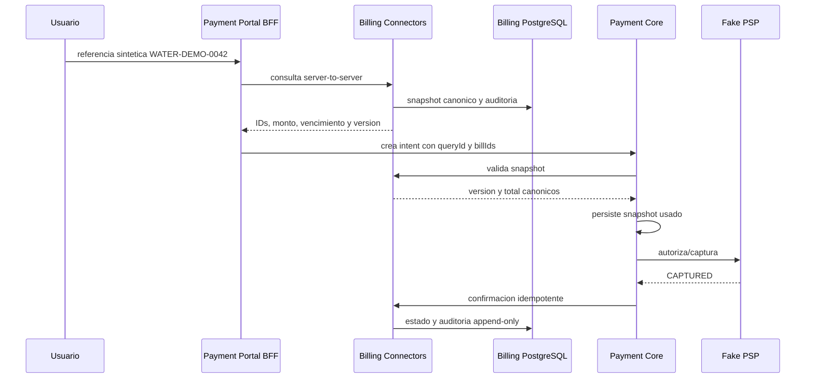

# Etapa 4 - Facturacion e integraciones de empresas

## Estado

- Estado interno: `DONE` para Alpha sintetica.
- Inicio y cierre interno: 2026-07-17.
- Baseline contractual: tag inmutable `contracts-v1-alpha.4`.
- Ambiente: `dev` local con PostgreSQL separado y datos sinteticos.
- Proveedor real: `DEFERRED` por `PG-03`; no habilita Beta ni produccion.

La regla de ADR 0005 aplica a este cierre: terminar el alcance controlable de
Alpha no sustituye convenio, sandbox ni certificacion externa. El criterio de
proveedor real queda satisfecho solo cuando `PG-03` cierre con evidencia.

## Tablero de trabajo

| ID | Entregable | Repositorio | Estado |
| --- | --- | --- | --- |
| E4.1 | Capacidades y operaciones canonicas | nexopay-contracts | DONE |
| E4.2 | Fake water, persistencia, aislamiento y circuit breaker | nexopay-billing-connectors | DONE |
| E4.3 | Snapshot y confirmacion desde Payment Core | nexopay-payments-platform | DONE |
| E4.4 | Consulta online visible en Payment Portal | nexopay-payment-portal | DONE |
| E4.5 | PostgreSQL, Compose y job Jenkins de Billing | nexopay-platform-infrastructure | DONE |
| E4.6 | Adaptador real ESVAL en sandbox | Externo / PG-03 | DEFERRED |

## Arquitectura implementada

`fake-water` declara consulta, reserva, confirmacion y reversa. El adaptador
`fake-water-slow` usa otro ejecutor, timeout y circuito, y declara reserva y
reversa como no soportadas. Esto permite validar degradacion sin inventar
capacidades de una empresa.

## Seguridad y datos

- La referencia del cliente viaja en body y solo alcanza Portal BFF y Billing.
- Payment Core no almacena referencia de cliente ni modelos particulares.
- Portal normaliza la respuesta y omite `externalReference` antes del browser.
- El secreto Alpha se mantiene server-to-server y nunca entra al bundle.
- Billing persiste hashes de request, no payloads de idempotencia.
- `biller_audit` rechaza `UPDATE` y `DELETE` mediante trigger.
- Logs y problemas no incluyen referencias de cliente ni bodies upstream.

## Criterios de salida

- [x] Fake biller pasa contract tests para cada capacidad declarada.
- [x] Un adaptador lento no agota el pool de otro adaptador.
- [x] Confirmacion inmediata y tardia son idempotentes y auditables.
- [x] Reversa no declarada responde `422`, no exito ficticio.
- [x] Consulta -> pago -> ledger -> confirmacion pasa en el ambiente local.
- [ ] Proveedor real completa sandbox: `DEFERRED PG-03`, bloquea Beta real.

## Evidencia tecnica

- Contracts: 29 schemas, 16 ejemplos, 18 pruebas, OpenAPI valido y
  compatibilidad sin breaking changes; tag `contracts-v1-alpha.4`.
- Billing: unit/contract tests de capacidades y aislamiento, mas suite de
  integracion PostgreSQL para replay, confirmacion tardia y auditoria inmutable.
- Payments: suite unitaria e integracion completa contra PostgreSQL/Kafka y
  baseline `alpha.4`; snapshot versionado queda en `payment_intents`.
- Portal: 4 pruebas BFF, lint, types, build Next y 12 Playwright exitosos en
  Chrome desktop/movil.
- Runtime: Billing `18082`, Payments `18081`, Portal `3000`, Checkout `3001` y
  SDK `3002`, todos con healthcheck.
- Commits publicados: Contracts `3abb853`, Billing `9d0a3a2`, Payments
  `76719e1`, Portal `a602a31`, Event Workers `bdd55e8` e infraestructura
  `70d9416`.
- Jenkins: Contracts #6, Billing #1, Payments #6 y Portal #3 finalizaron
  `SUCCESS`; Billing publico 5 pruebas y Payments 22, sin fallos ni omitidas.
- Prueba funcional: monto `36378 CLP`, replay con un intento, tardia
  `PENDING -> CONFIRMED` con dos intentos, reversa no soportada `422`, adaptador
  lento `503` y cero transacciones de ledger desbalanceadas.
- Demo post-CI: 2 pagos capturados con snapshot `fake-water-v1`, 3
  confirmaciones auditadas, `401` sin secreto y referencia de cliente ausente
  en logs.

## Limites y riesgos abiertos

- No existe integracion, convenio, API ni sandbox ESVAL autorizado.
- La topologia local y el fake biller no prueban SLA ni limites reales.
- La entrega sincrona puede quedar pendiente si falla la red despues de
  capturar; outbox/inbox, backoff y dead-letter se completan en Etapa 6.
- El secreto compartido local debe migrar a identidad de workload.
- Datos personales, retencion real y DPA siguen bloqueados por PG-05.

## Siguiente accion

Iniciar Etapa 5 para el plano de gestion. En paralelo, obtener de ESVAL o del
primer facturador contratado la especificacion, credenciales y datos sandbox
que permitan cerrar `PG-03` sin inferir endpoints ni usar datos reales.
