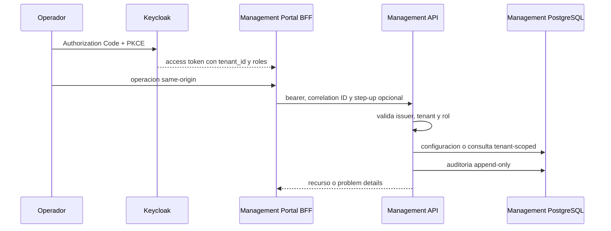

# Etapa 5 - Plano de gestion

## Estado

- Estado interno: `DONE` para Alpha sintetica.
- Inicio y cierre interno: 2026-07-17.
- Baseline contractual: tag inmutable `contracts-v1-alpha.5`.
- Ambiente: local, Keycloak y PostgreSQL de gestion separados.
- Datos reales: prohibidos mientras `PG-05` y `PG-06` permanezcan abiertos.

## Tablero de trabajo

| ID | Entregable | Repositorio | Estado |
| --- | --- | --- | --- |
| E5.1 | OpenAPI y schemas de gestion | nexopay-contracts | DONE |
| E5.2 | OIDC, tenancy, RBAC y step-up backend | nexopay-management-api | DONE |
| E5.3 | Comercios, sucursales, usuarios y configuracion | nexopay-management-api | DONE |
| E5.4 | Auditoria y proyecciones/exportacion acotada | nexopay-management-api | DONE |
| E5.5 | Portal, BFF OIDC y estados de permisos | nexopay-management-portal | DONE |
| E5.6 | Keycloak, PostgreSQL, Compose y Jenkins | nexopay-platform-infrastructure | DONE |

## Arquitectura implementada

El portal nunca recibe credenciales de PostgreSQL ni entrega el access token a
JavaScript. Management API posee su base y no tiene credenciales ni acceso de
red a Payments PostgreSQL. Las vistas de pagos son modelos de lectura, no
verdad financiera.

## Seguridad y tenancy

- `tenant_id` y roles provienen del JWT firmado; no se aceptan desde bodies.
- Toda referencia cruzada de tenant responde `404` para no filtrar existencia.
- RBAC se aplica en backend aunque el portal oculte/deshabilite controles.
- Referencias de secretos solo aceptan `vault://` o
  `aws-secretsmanager://`; nunca material secreto.
- Cambios de acceso y referencias de secretos exigen `auth_time` menor a cinco
  minutos y confirmacion `X-NexoPay-Step-Up: confirmed`.
- Mutaciones del BFF exigen `Origin` exacto y la sesion usa cookie `HttpOnly`.
- `management_audit` rechaza `UPDATE` y `DELETE` mediante trigger.

## Criterios de salida

- [x] Aislamiento multi-tenant probado con referencia cruzada.
- [x] RBAC validado en backend y auditoria consultable e inmutable.
- [x] Checkout y webhook configurables sin tocar Payment Core.
- [x] Operaciones sensibles requieren confirmacion reforzada reciente.
- [x] Portal representa estados editables, solo lectura y errores.

## Evidencia tecnica

- Contracts: 38 schemas, 20 ejemplos, 20 pruebas, OpenAPI sin advertencias y
  compatibilidad sin rupturas; tag `contracts-v1-alpha.5`, commit `b2c603f`.
- Management API: Kotlin/Spring Boot, Java 21, Flyway, PostgreSQL, resource
  server JWT, cinco pruebas de politica y JAR reproducible; commit `eb9dd75`.
- Management Portal: Next.js 16, React 19, BFF OIDC/PKCE, cuatro pruebas
  Vitest, lint, tipos y build standalone; commit `ebf5b0c`.
- Playwright: cuatro casos exitosos en Chrome escritorio/movil con login real,
  admin y viewer; valida `404`, `403`, `428`, configuracion, webhook, secreto,
  auditoria y CSV.
- Runtime: Keycloak `8180`, Management API `18083`, Portal `3003` y PostgreSQL
  `55434`, todos saludables.
- PostgreSQL: 6 entradas auditadas, 2 webhooks y 2 referencias generadas por la
  matriz dual; una proyeccion por tenant y alteracion de auditoria rechazada.
- Logs: sin claves de usuarios ni referencia `vault://` sensible.
- Event Workers `243068a`: la ingesta idempotente queda explicitamente en
  Etapa 6; no se crea acceso cruzado temporal a bases.
- Infraestructura `6bb218d`: realm importable, Compose, healthchecks y jobs CI.
- Jenkins: Management API #1 y Management Portal #2 finalizaron `SUCCESS`;
  API publico cinco pruebas y JAR, Portal cuatro pruebas y build standalone.

## Limites y riesgos abiertos

- Keycloak usa `start-dev`, claves publicas locales y un solo nodo.
- No se almacenan personas ni credenciales reales; privacidad y secret manager
  administrado siguen bloqueados por `PG-05` y `PG-06`.
- Los usuarios de dominio se sincronizan por seed Alpha; provisionamiento
  federado, invitaciones y ciclo de baja empresarial requieren definicion Beta.
- Las proyecciones son fixtures sinteticos. Inbox, replay y consumo Kafka se
  implementan en Etapa 6.
- La exportacion se limita a 100 filas; reportes masivos requeriran jobs
  asincronos y object storage.

## Siguiente accion

Iniciar Etapa 6 con inbox/deduplicacion, entrega webhook firmada, proyecciones
idempotentes, conciliacion, alertas y runbooks. Mantener prohibidos datos y
dinero real hasta cerrar los gates productivos.
